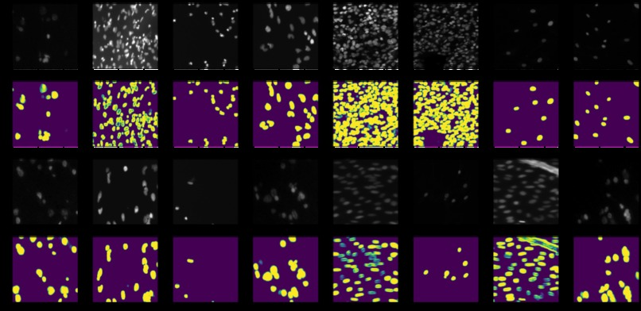
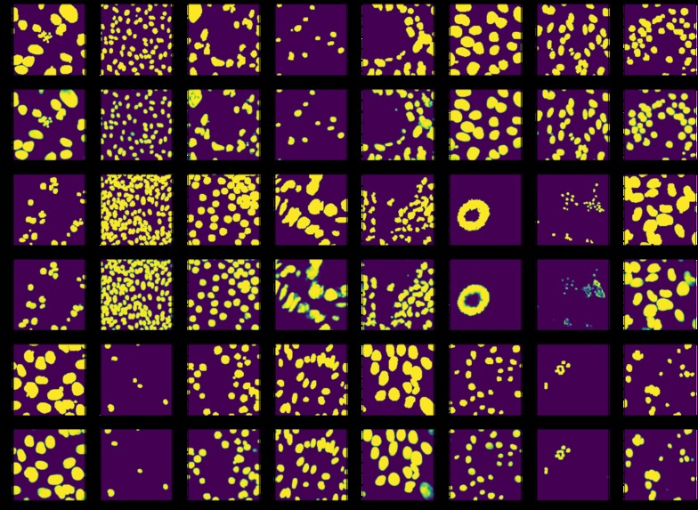

# AcCELLerate
Using Machine Learning for Nuclei detection in order to accelerate medical discovery, drug discovery &amp; cures for diseases

 
This is the test set. Rows alternate from input image to predicted image

 
This is the training set. Rows alternate from ground truth to predicted image

## Inspiration

Why don't we have immortality? What are so many people still plagued with diseases? I mean, we're in the 21st century right - why are we still infested with the same diseases that our ancestors had to deal with for thousands of years?

We still haven't cured diseases, but that isn't due to a lack of effort. We've made huge strides and progress. From automating laboratories to new drug discovery technologies.

But one bottleneck still remains: analyzing the data. We can get robots to automate the synthesis of drugs, experimentation and even microscopy, but not data analysis.

So why don't we use machine learning to do that for us. To use Machine learning to pear into the microscopic world, to aid us to acCELLerate the curing of all diseases!

## What it does
One major task that scientists undergo is identifying the nuclei within cells. Cells are complicated. They have lots of different types, shapes, stains, and states. Thus we have to find a generalized way of tackling this problem (else the biologist literally has to look at the images themselves).

I utilize a Fully Connected DenseNet Segmentation model (after the paper The One Hundred Layers Tiramisu) to tackle this very problem and have the capability to detect and create a masking layer onto of the image to localize all the nuclei in an image. This model is generalized to be able to tackle all states in which cells can be in.

## How we built it
Used Numpy, Scikit Learn, and Pandas to do all the data processing. Then found a recent paper on a cool segmentation model and implemented it in Tensorflow Keras. 

## Challenges we ran into
I had never implemented a paper in my life, so I had to overcome that challenge and implement this paper! I also hadn't played with Image Segmentation before, nor made a densenet - but I was able to break through those barriers and built it all out 

## Accomplishments that we're proud of
Being able to overcome my challenge: Implementing a paper and learning quickly while under pressure.

## What we learned
How to implement a paper, how to implement DenseNets, dataprocessing

## What's next for acCELLerate
There are certainly other ways in which biologists are analyzing the data - it's not just nuclei identification. To expand to other types of analysis using a Machine Learning lens allows us to be able to acCELLerate the process of us never dying by diseases again!
